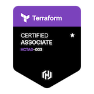
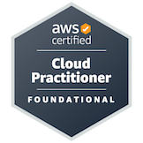

# Hunter Matthews


```text
                       __    __     __                              __     __
   ____ ___   ____ _  / /_  / /_   / /_   ___  _      __   _____   / /_   / /_
  / __ `__ \ / __ `/ / __/ / __/  / __ \ / _ \| | /| / /  / ___/  / __ \ / __/
 / / / / / // /_/ / / /_  / /_   / / / //  __/| |/ |/ /  (__  )  / / / // /_
/_/ /_/ /_/ \__,_/  \__/  \__/  /_/ /_/ \___/ |__/|__/  /____/  /_/ /_/ \__/

~> **finger matthewsht**
Login: matthewsht                             Name: Hunter Matthews
Directory: /home/matthewsht                   Shell: /usr/bin/fish
Plan:
NIH says I'm a "Scientific System Administrator"
GDIT says I'm a "Platform Engineer Sr Principal"
Either way I'm a unix/automation sysadmin working for Gillian on the SSA (Unix) Team.
Project:
```

Projects I typically work on nowadays:

- [SSA Team's Packer Repository](https://github.com/NHGRI/ssa-packer)
- [SSA Team's Terraform Repository](https://github.com/NHGRI/ssa-terraform)

And still occasionally working on:

- [SSA Team's Saltstack Repository](https://github.com/NHGRI/saltstack)


[](https://www.credly.com/badges/b279ef7c-fb0f-4023-9a90-8f9175798c3f/public_url)
[](https://www.credly.com/badges/4a0d3f74-01fe-45d0-94e9-d8d1ca25dc51/public_url)
